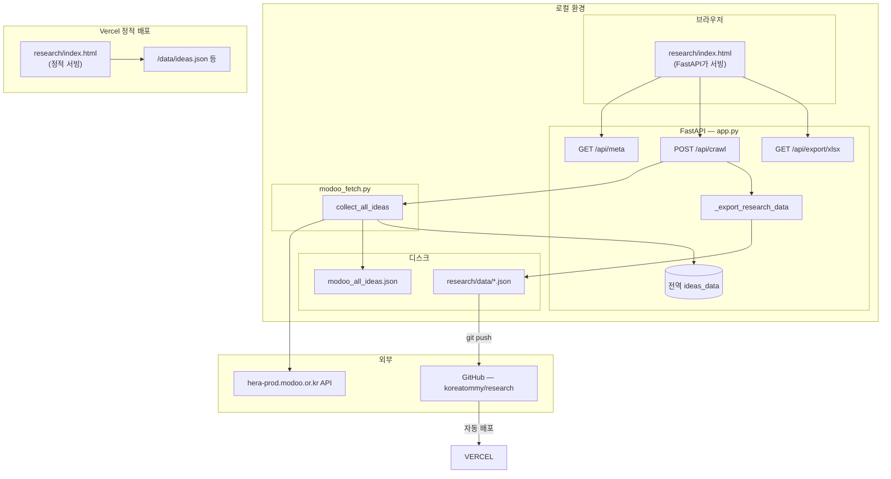
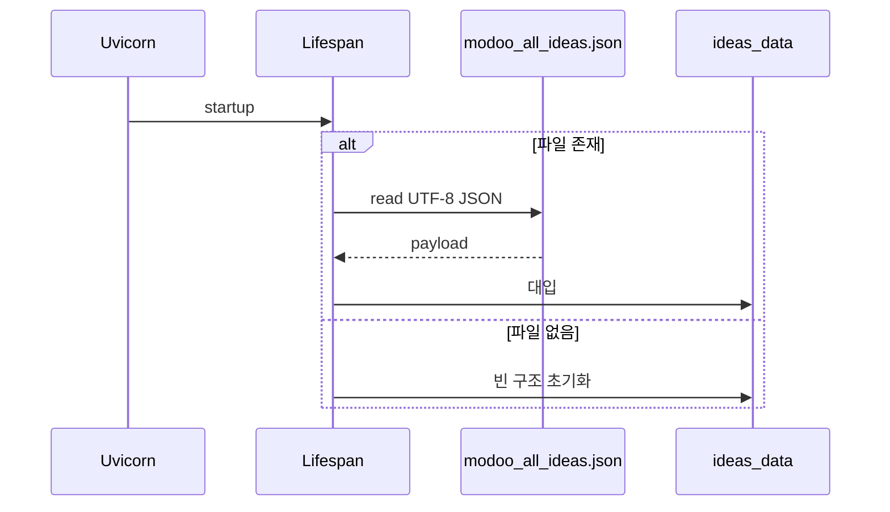
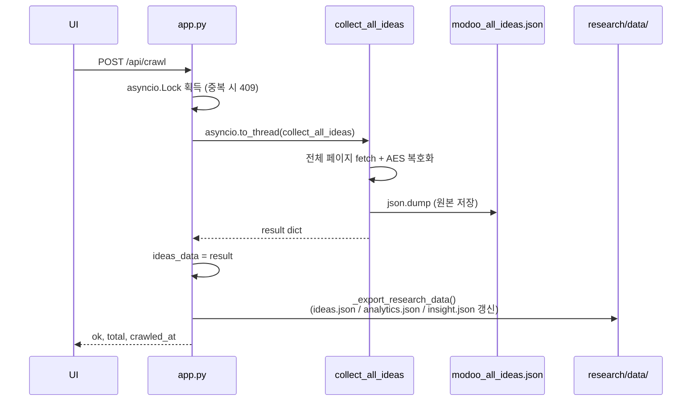
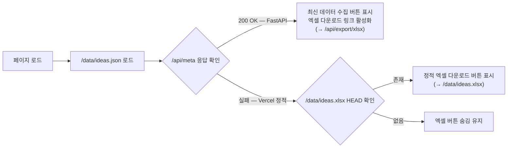

# 모두의 창업 아이디어 뷰어 — 프로젝트 가이드

[모두의 창업(modoo.or.kr)](https://www.modoo.or.kr/idea/list) 공개 아이디어 목록을 **공식 API**에서 가져와 JSON으로 저장하고, **FastAPI**로 로컬에서 조회·수집·내보내기를 할 수 있는 도구입니다.  
수집한 데이터는 `research/data/`에 정적 파일로 내보내 **Vercel 정적 배포**로 누구나 볼 수 있게 공개합니다.

---

## 1. 기술 스택

| 구분 | 기술 | 용도 |
|------|------|------|
| 언어 | Python 3.9+ | 서버·수집 스크립트 |
| 웹 프레임워크 | FastAPI | REST API, 정적 파일 마운트 |
| ASGI 서버 | Uvicorn | `python3 -m uvicorn app:app` |
| HTTP 클라이언트 | 표준 `urllib` | API 요청(외부 의존 최소화) |
| 복호화 | PyCryptodome (AES-CBC) | API 응답 `data` 필드 복호화 |
| 엑셀 | openpyxl | `/api/export/xlsx` 생성 |
| 프론트 | HTML5 + CSS3 + 바닐라 JS | 테이블·페이징·수집·다운로드 UI |
| 정적 배포 | Vercel + GitHub | `git push` 시 자동 배포 |

의존성 목록은 [`requirements.txt`](requirements.txt)를 기준으로 합니다.

---

## 2. 환경 구분

| 환경 | 주소 | 실행 방법 | 특징 |
|------|------|-----------|------|
| **로컬 (FastAPI)** | `http://127.0.0.1:8000` | `npm run dev` | 최신 데이터 수집·엑셀 다운로드 버튼 활성화 |
| **Vercel (정적 배포)** | `https://research-theta-indol.vercel.app` | `git push origin main` | 수집 버튼 숨김, 정적 JSON만 서빙 |

---

## 3. 디렉터리 구조

```text
modoo/
├── app.py                    # FastAPI 앱 — API·수집 트리거·엑셀 내보내기
├── modoo_fetch.py            # API 호출·AES 복호화·전체 수집(collect_all_ideas)
├── modoo_filters.py          # 분야·세부분야·키워드 필터 로직
├── modoo_analytics.py        # 통계 분석(compute_analytics)
├── modoo_insight.py          # 인사이트 분석(compute_insight)
├── export_for_research.py    # CLI: modoo_all_ideas.json → research/data/ 내보내기
├── crawl_modoo_all.py        # CLI: 전체 수집 후 modoo_all_ideas.json 저장
├── modoo_all_ideas.json      # 수집 결과 원본(서버 기동 시 로드)
├── package.json              # npm run dev / npm run build
├── requirements.txt
├── guide.md                  # 본 문서
├── new_deploy.md             # 최신 수집 → 배포 원라인 절차
│
├── research/                 # Vercel 배포 소스 (정적 사이트)
│   ├── index.html            # 아이디어 목록 뷰어
│   ├── analytics.html        # Raw data 분석 페이지
│   ├── insight.html          # Insight 보고서 페이지
│   ├── vercel.json           # /analytics, /insight 리라이트
│   ├── static/
│   │   ├── app.js            # 목록 UI — /data/ideas.json 로드, FastAPI 감지 시 수집 버튼 표시
│   │   ├── analytics.js      # 분석 UI — /data/analytics.json 로드
│   │   ├── insight.js        # 인사이트 UI — /data/insight.json 로드
│   │   ├── style.css
│   │   ├── analytics.css
│   │   └── insight.css (있으면)
│   └── data/
│       ├── ideas.json        # 배포용 아이디어 목록 (export_for_research.py 생성)
│       ├── analytics.json    # 배포용 통계 데이터
│       └── insight.json      # 배포용 인사이트 데이터
│
└── vercel.json               # 루트 빌드 설정 (buildCommand: npm run build)
```

**핵심 플로우**: `app.py` + `modoo_fetch.py` + `research/` + `modoo_all_ideas.json`

---

## 4. 시스템 구조도



---

## 5. 데이터 흐름

### 5.1 서버 기동



### 5.2 최신 데이터 수집 (`POST /api/crawl`)



- **`asyncio.to_thread`**: 동기 I/O가 이벤트 루프를 막지 않도록 워커 스레드 실행
- **`asyncio.Lock`**: 동시 수집 방지 (두 번째 요청은 409)
- **자동 export**: 수집 완료 시 `research/data/` 세 파일을 즉시 갱신 → UI 새로고침 없이 최신 데이터 반영

### 5.3 프론트엔드 API 감지



`research/static/app.js`가 `/api/meta`를 2초 타임아웃으로 확인해 FastAPI 환경인지 자동 감지합니다.  
Vercel 정적 환경에서는 `/data/ideas.xlsx` 파일 존재 여부를 HEAD 요청으로 추가 확인합니다.

---

## 6. HTTP API 요약

| 메서드 | 경로 | 설명 |
|--------|------|------|
| GET | `/` | `research/index.html` 서빙 |
| GET | `/analytics` | `research/analytics.html` 서빙 |
| GET | `/insight` | `research/insight.html` 서빙 |
| GET | `/static/*` | CSS·JS 정적 자원 (`research/static/`) |
| GET | `/data/*` | 데이터 파일 (`research/data/` — JSON·xlsx 포함) |
| GET | `/api/meta` | 총 건수·수집일·분야 목록 |
| GET | `/api/ideas` | 페이징 목록 (`page`, `page_size`, `division`, `subcategory`, `q`) |
| POST | `/api/crawl` | 전체 재수집 + `modoo_all_ideas.json` + `research/data/` 갱신 |
| GET | `/api/analytics` | 통계 분석 JSON |
| GET | `/api/insight` | 인사이트 분석 JSON |
| GET | `/api/export/json` | `ideas_data` 전체 JSON 다운로드 |
| GET | `/api/export/xlsx` | 엑셀 다운로드 |

오류 코드: 수집 중 중복 `409`, 수집 실패 `500`, openpyxl 미설치 시 xlsx `500`

---

## 7. 실행 방법

### 의존성 설치 (최초 1회)

```bash
cd /Users/eugene/Downloads/modoo
pip3 install -r requirements.txt
```

### 로컬 서버 시작

```bash
npm run dev
```

→ `http://127.0.0.1:8000` 접속

### 로컬 서버 중지

```
Ctrl + C
```

또는 이미 백그라운드에서 실행 중인 경우:

```bash
kill $(lsof -ti :8000)
```

---

## 8. 최신 데이터 수집 및 배포

### 방법 1 — 웹 UI (권장)

1. `npm run dev` 로 서버 시작
2. `http://127.0.0.1:8000` 접속
3. **"최신 데이터 수집"** 버튼 클릭
4. 완료 후 `research/data/ideas.json`, `analytics.json`, `insight.json` 자동 갱신
5. 로컬에서 **엑셀 다운로드** → `research/data/ideas.xlsx` 로 저장 (덮어쓰기)
6. git push로 Vercel 배포

### 방법 2 — 터미널 원라인

```bash
cd /Users/eugene/Downloads/modoo && \
python3 crawl_modoo_all.py && \
python3 export_for_research.py && \
git add research/data/ && \
git commit -m "data: 최신 아이디어 데이터 갱신" && \
git push origin main
```

### 웹용 엑셀 파일 업데이트 방법

Vercel 배포 페이지의 엑셀 다운로드는 `research/data/ideas.xlsx` 정적 파일을 제공합니다.  
최신 데이터 수집 후 아래 순서로 갱신합니다.

```
1. 로컬 FastAPI(http://127.0.0.1:8000)에서 엑셀 다운로드
2. 다운받은 파일을 research/data/ideas.xlsx 로 덮어쓰기
3. git add research/data/ideas.xlsx
4. git commit -m "data: 엑셀 갱신"
5. git push origin main
```

| 환경 | 엑셀 다운로드 방식 |
|------|-------------------|
| **로컬 FastAPI** | `/api/export/xlsx` → 서버에서 실시간 생성 |
| **Vercel 정적** | `/data/ideas.xlsx` → 미리 올린 파일 다운로드 |

### Vercel 자동 배포 흐름

```
git push origin main
  → GitHub (koreatommy/research)
  → Vercel 빌드 트리거 (npm run build)
  → research/ → out/ 복사
  → https://research-theta-indol.vercel.app 배포 완료 (1~2분)
```

---

## 9. JSON 데이터 스키마 (`modoo_all_ideas.json`)

최상위 필드:

| 필드 | 설명 |
|------|------|
| `crawled_at` | ISO 형식 수집 시각 |
| `url` | 출처 URL |
| `api` | `endpoint`, `page_size`, `total_pages_fetched`, `total_count_reported` |
| `total` | `ideas` 배열 길이 |
| `ideas` | 아이디어 객체 배열 |

`ideas[]` 각 요소:

| 필드 | 설명 |
|------|------|
| `index` | 전체 통합 일련번호 (1부터) |
| `id` | 원본 API id |
| `summary` | 아이디어 요약 |
| `division` | 분야(한글) |
| `subcategory` | 세부분야 |
| `nickname` | 도전자 닉네임 |
| `likes` | 좋아요 수 |
| `is_public` | 공개 여부 |
| `tags` | 태그 이름 문자열 배열 |
| `created_at` | 등록 시각 |

---

## 10. 기타 스크립트

| 파일 | 용도 |
|------|------|
| `analyze_modoo.py` | 오프라인 분석 스크립트 |
| `generate_report.py` | HTML 리포트 생성 |
| `crawl_modoo_idea.py` | 개별 아이디어 상세 크롤 |
| `crawl_modoo_idea_view.py` | Playwright 기반 뷰 크롤 |

웹 뷰어 확장 시에는 `app.py` / `modoo_fetch.py` / `research/` 를 우선 참고하세요.

---

## 11. 보안·운영 참고

- 외부 공개 API 호출 시 **과도한 빈도**는 피하세요 (페이지 간 0.25초 지연 적용 중)
- 수집·복호화 로직은 **modoo 서비스 정책·이용약관** 준수 범위에서만 사용하세요
- 로컬 JSON에 개인 식별 가능 정보가 포함될 수 있으므로 **공유·백업 시 주의**하세요

---

*마지막 업데이트: 2026-04-08 (웹용 정적 엑셀 다운로드 추가)*
