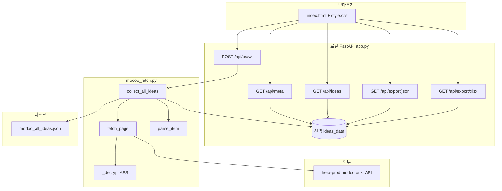
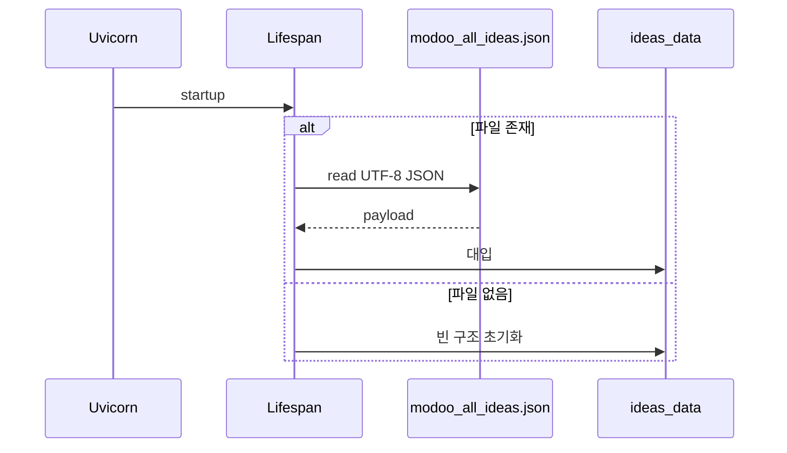
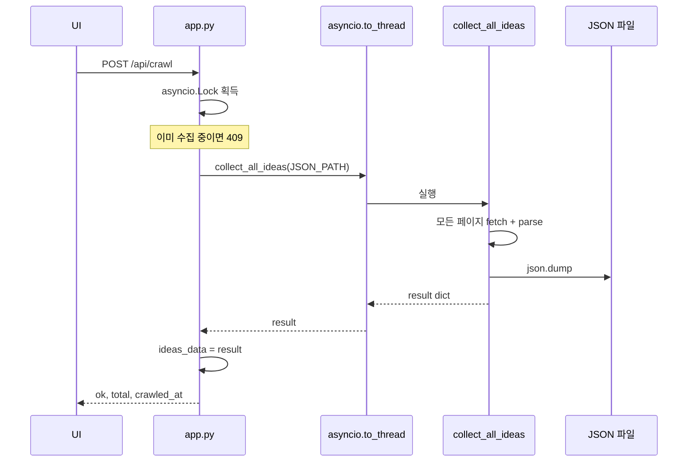

# 모두의 창업 아이디어 뷰어 — 프로젝트 가이드

[모두의 창업(modoo.or.kr)](https://www.modoo.or.kr/idea/list) 공개 아이디어 목록을 **공식 API**에서 가져와 JSON으로 저장하고, **FastAPI**로 웹에서 조회·수집·보내기 할 수 있는 로컬 도구입니다.

---

## 1. 기술 스택

| 구분 | 기술 | 용도 |
|------|------|------|
| 언어 | Python 3.9+ | 서버·수집 스크립트 |
| 웹 프레임워크 | FastAPI | REST API, 정적 파일 마운트 |
| ASGI 서버 | Uvicorn | `app:app` 실행 |
| HTTP 클라이언트 | 표준 `urllib` | API 요청(외부 의존 최소화) |
| 복호화 | PyCryptodome (AES-CBC) | API 응답 `data` 필드 복호화 |
| 엑셀 | openpyxl | `/api/export/xlsx` 생성 |
| 프론트 | HTML5 + CSS3 + 바닐라 JS | 테이블·페이징·수집·다운로드 UI |
| (선택/기타) | Playwright | 동일 저장소 내 다른 크롤 스크립트용 (`requirements.txt`에 명시) |

의존성 목록은 [`requirements.txt`](requirements.txt)를 기준으로 합니다.

---

## 2. 디렉터리 구조

```text
modoo/
├── app.py                 # FastAPI 앱·API·수집 트리거·보내기
├── modoo_fetch.py         # API 호출·AES 복호화·전체 수집(collect_all_ideas)
├── crawl_modoo_all.py     # CLI: 전체 수집 후 JSON 저장
├── modoo_all_ideas.json   # 기본 데이터 파일(수집 결과·앱 기동 시 로드)
├── requirements.txt
├── guide.md               # 본 문서
├── static/
│   ├── index.html         # 뷰어 UI
│   └── style.css
└── (기타)                 # analyze_modoo.py, generate_report.py, crawl_modoo_idea*.py 등
                           # 분석·리포트·별도 크롤 경로 — 웹 뷰어 핵심 경로와는 독립
```

핵심 웹 뷰어 플로우는 **`app.py` + `modoo_fetch.py` + `static/` + `modoo_all_ideas.json`** 네 축으로 이해하면 됩니다.

---

## 3. 시스템 구조도



---

## 4. 데이터 흐름

### 4.1 애플리케이션 기동



- **단일 소스**: 런타임 목록은 메모리의 `ideas_data`이며, 수집 완료 시 같은 내용이 `modoo_all_ideas.json`에도 기록됩니다.
- 서버 재시작 시 디스크 JSON이 다시 로드됩니다.

### 4.2 목록 API(페이징)

1. `GET /api/ideas?page=1&page_size=12`  
2. `ideas_data["ideas"]` 전체 길이로 `total`, `total_pages` 계산  
3. 슬라이스 `[start:end]`로 `items` 반환  

페이지는 **1부터 시작**합니다.

### 4.3 최신 수집(`POST /api/crawl`)



- **`asyncio.to_thread`**: 동기 I/O·복호화 루프가 이벤트 루프를 막지 않도록 워커 스레드에서 실행합니다.
- **`asyncio.Lock`**: 동시에 두 번 수집이 돌지 않도록 합니다(대기 중 두 번째는 409).

### 4.4 외부 API → 복호화 로직 (`modoo_fetch.py`)

1. **요청 URL**  
   `BASE_URL` = `https://hera-prod.modoo.or.kr/api/v1/startup-idea`  
   쿼리: `page`, `size`(기본 12), `sort=createdAt,desc`

2. **헤더**  
   브라우저와 유사한 `User-Agent`, `Referer`/`Origin`을 `www.modoo.or.kr` 기준으로 설정합니다.

3. **응답 형태**  
   JSON에 `data`(Base64 암호문), `timestamp` 등이 옵니다.

4. **복호화 `_decrypt`**  
   - 키: `str(timestamp)`를 왼쪽으로 패딩해 **16바이트**로 자른 UTF-8 문자열  
   - 알고리즘: **AES-CBC**, IV = 키와 동일 16바이트(서버 규약에 맞춘 구현)  
   - 평문: PKCS 패딩 제거 후 JSON 파싱 → 아이디어 객체 배열

5. **정규화 `parse_item`**  
   - `division` 코드 → 한글 라벨(`DIVISION_MAP`)  
   - `applicant.nickname`, `likeCount`, `tags` 배열 등을 뷰어용 필드로 정리합니다.

6. **`collect_all_ideas`**  
   - 0페이지로 `totalPage` 확인 후 `0 .. totalPages-1` 순회  
   - 1페이지 이후 요청 사이 **0.25초 지연**(서버 부담 완화)  
   - 결과 스키마는 아래 **5절** 참고.

---

## 5. JSON 데이터 스키마 (`modoo_all_ideas.json`)

최상위 객체 예시 필드:

| 필드 | 설명 |
|------|------|
| `crawled_at` | ISO 형식 수집 시각 |
| `url` | 출처 안내용 URL (`https://www.modoo.or.kr/idea/list`) |
| `api` | `endpoint`, `page_size`, `total_pages_fetched`, `total_count_reported` |
| `total` | `ideas` 배열 길이 |
| `ideas` | 아이디어 객체 배열 |

`ideas[]` 각 요소(정규화 후):

| 필드 | 설명 |
|------|------|
| `index` | 전체 목록 통합 일련번호(1부터) |
| `id` | 원본 API id |
| `summary` | 아이디어 요약 |
| `division` | 분야(한글) |
| `nickname` | 도전자 닉네임 |
| `likes` | 좋아요 수 |
| `is_public` | 공개 여부 |
| `tags` | 태그 이름 문자열 배열 |
| `created_at` | 등록 시각(원본 필드명 매핑) |

---

## 6. HTTP API 요약

| 메서드 | 경로 | 설명 |
|--------|------|------|
| GET | `/` | `static/index.html` 서빙 |
| GET | `/static/*` | CSS 등 정적 자원 |
| GET | `/api/meta` | 총 건수, 수집일, 출처 URL, 안내 메시지 |
| GET | `/api/ideas` | 페이징 목록 `page`, `page_size` |
| POST | `/api/crawl` | 전체 재수집 + JSON 저장 + 메모리 갱신 |
| GET | `/api/export/json` | 현재 `ideas_data` 전체 JSON 다운로드 |
| GET | `/api/export/xlsx` | 엑셀 다운로드(문자열 내 Excel 금지 제어 문자 제거) |

오류 코드 예: 수집 중 중복 `409`, 수집 실패 `500`, openpyxl 미설치 시 xlsx `500`.

---

## 7. 프론트엔드 동작 (`static/`)

- **최신 데이터 수집**: `POST /api/crawl` — 버튼 비활성·로딩 문구, 완료 후 `loadMeta` + `loadIdeas`(1페이지로 리셋).
- **페이징**: 처음/이전/다음/마지막 + 페이지당 건수 선택.
- **다운로드**: 같은 출처 링크로 `/api/export/json`, `/api/export/xlsx` 호출(`Content-Disposition: attachment`).

---

## 8. 실행 방법 (macOS 예시)

`pip`/`uvicorn`이 PATH에 없을 수 있으므로 **모듈 실행**을 권장합니다.

```bash
cd /path/to/modoo
pip3 install -r requirements.txt
python3 -m uvicorn app:app --reload --host 127.0.0.1 --port 8000
```

브라우저에서 `http://127.0.0.1:8000` 접속.

CLI만으로 수집할 때:

```bash
python3 crawl_modoo_all.py
```

---

## 9. 기타 스크립트와의 관계

같은 폴더의 `analyze_modoo.py`, `generate_report.py`, `crawl_modoo_idea.py`, `crawl_modoo_idea_view.py` 등은 **분석·리포트·다른 방식의 수집**용으로 보이며, 위에서 설명한 **웹 뷰어 + `modoo_fetch.collect_all_ideas`** 경로와는 코드 의존이 분리되어 있습니다. 웹 뷰어 확장 시에는 `app.py` / `modoo_fetch.py`를 우선 참고하면 됩니다.

---

## 10. 보안·운영 참고

- 외부 공개 API를 호출하므로 **과도한 빈도**의 수집은 피하는 것이 좋습니다(이미 페이지 간 지연 적용).
- 수집·복호화 로직은 **modoo 서비스 정책·이용약관**을 준수하는 범위에서만 사용해야 합니다.
- 로컬 JSON에 개인 식별 가능 정보가 포함될 수 있으므로 **공유·백업 시 주의**하세요.

---

*문서 버전: 프로젝트 디렉터리 기준으로 생성되었습니다. API URL·필드는 서버 측 변경 시 실제 응답과 다를 수 있습니다.*
